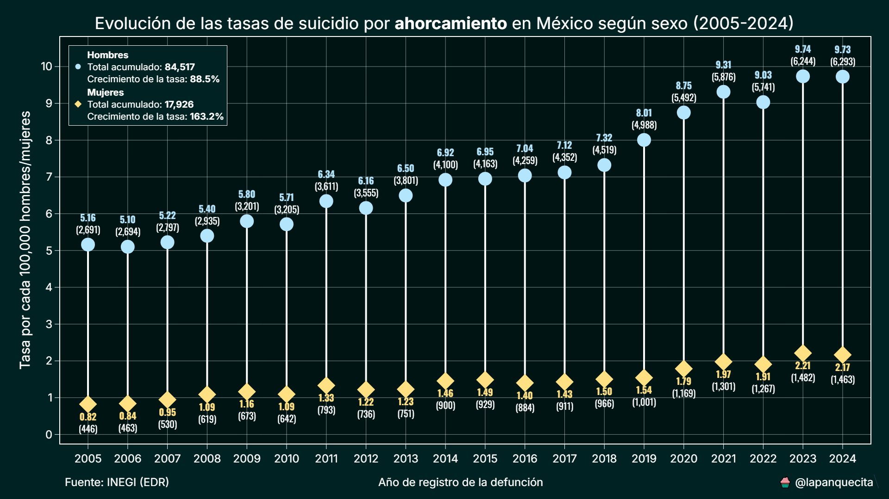
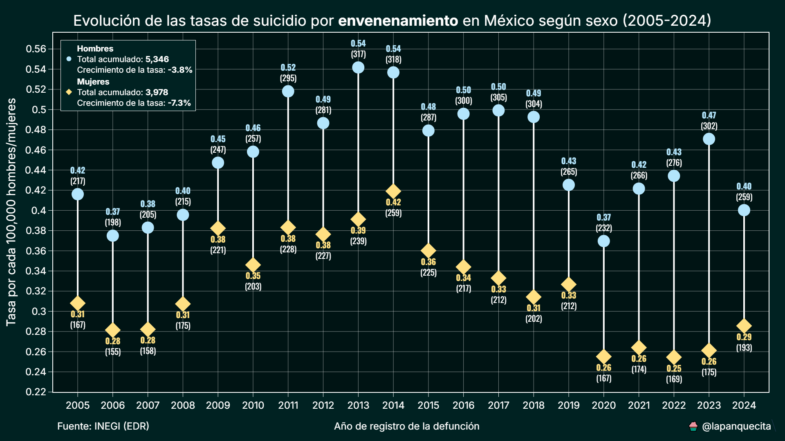
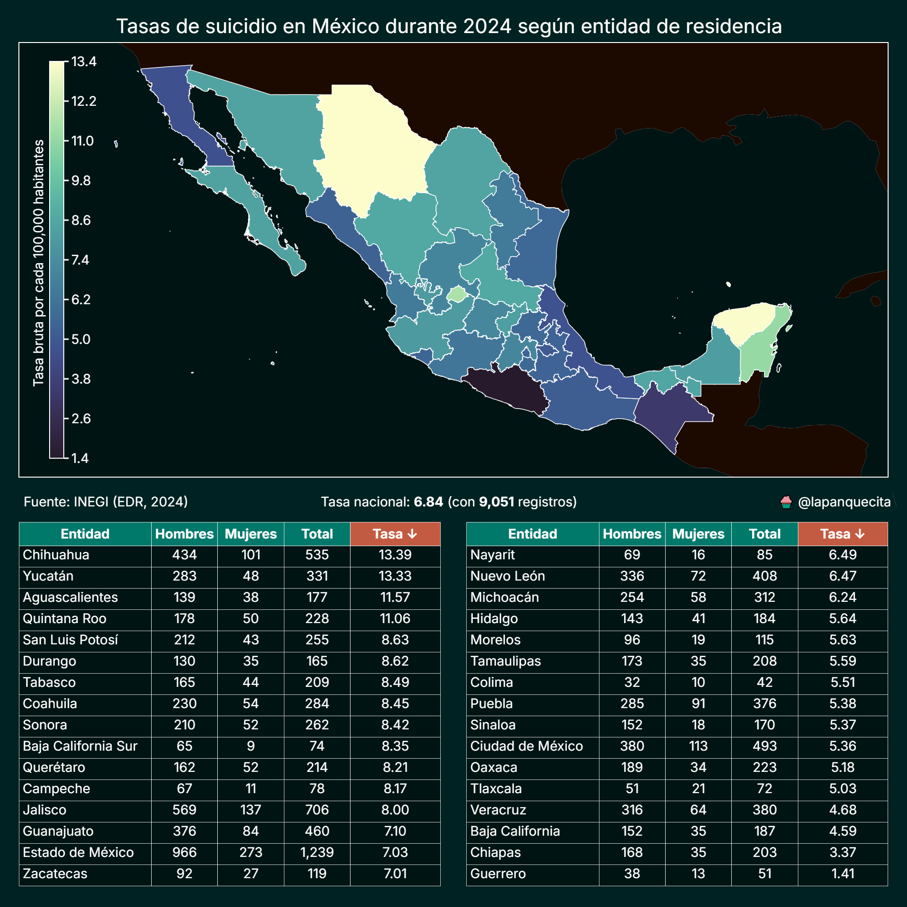
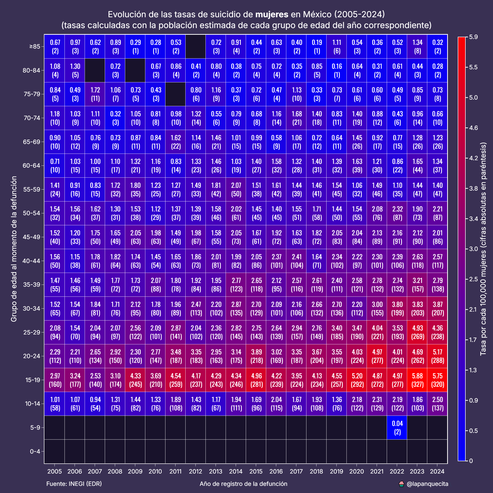
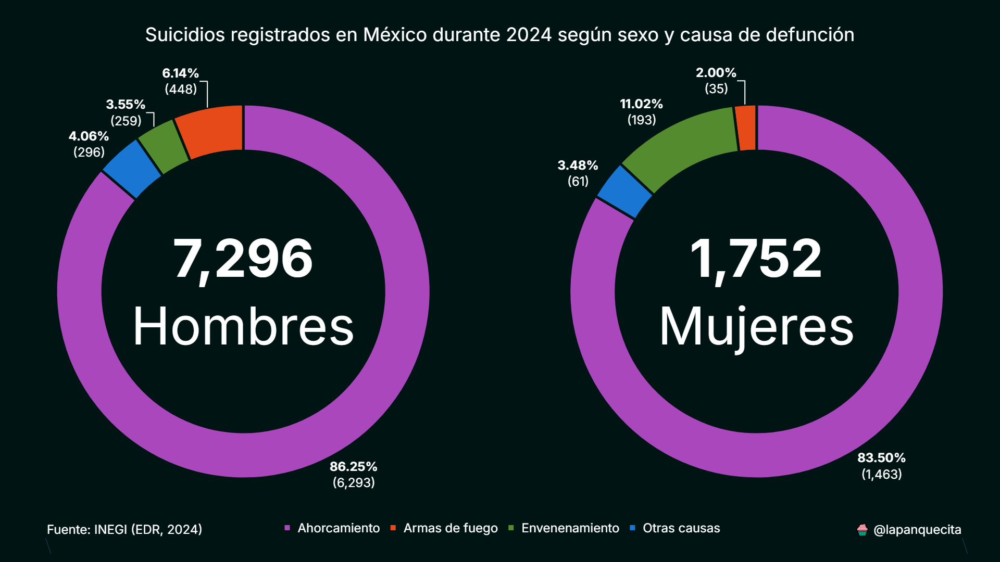
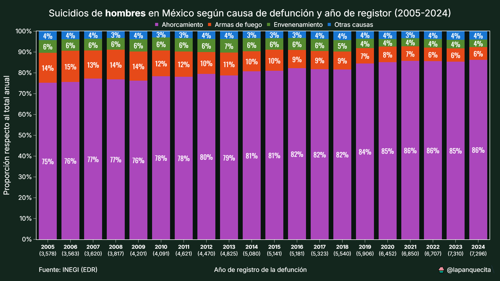
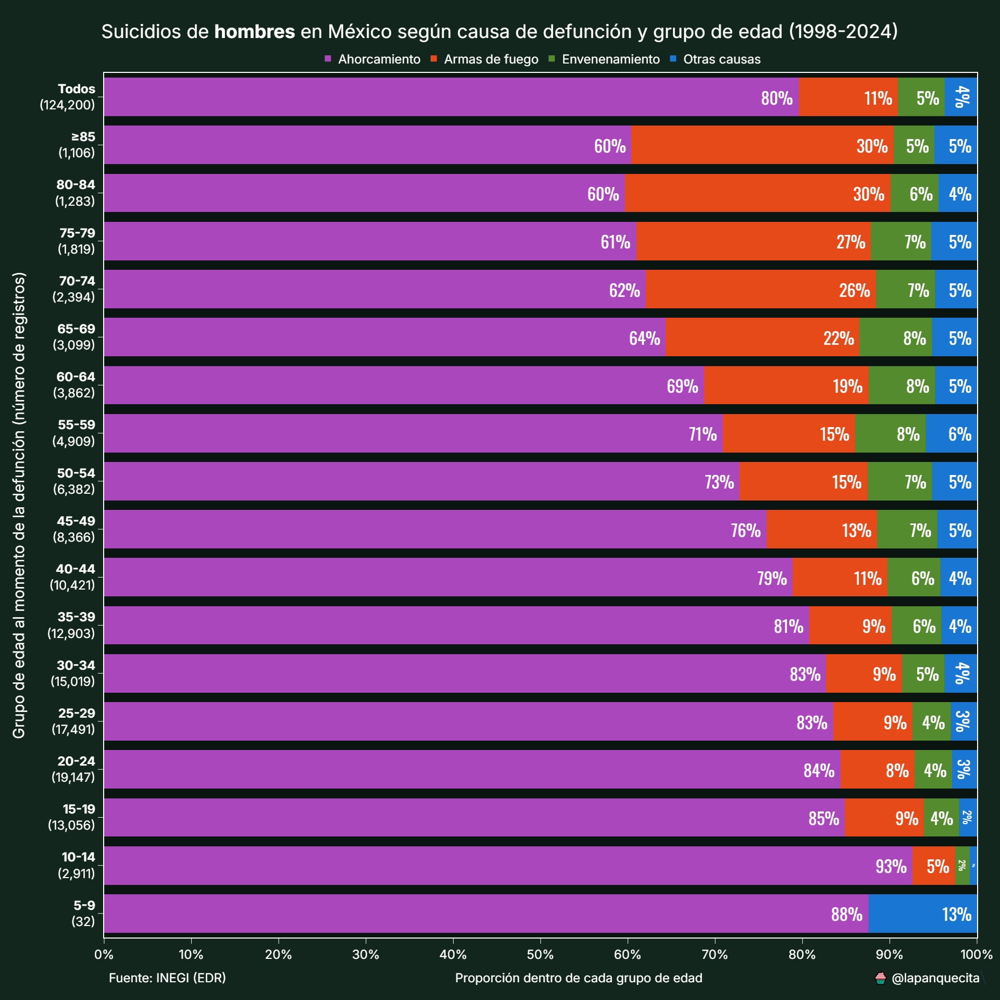
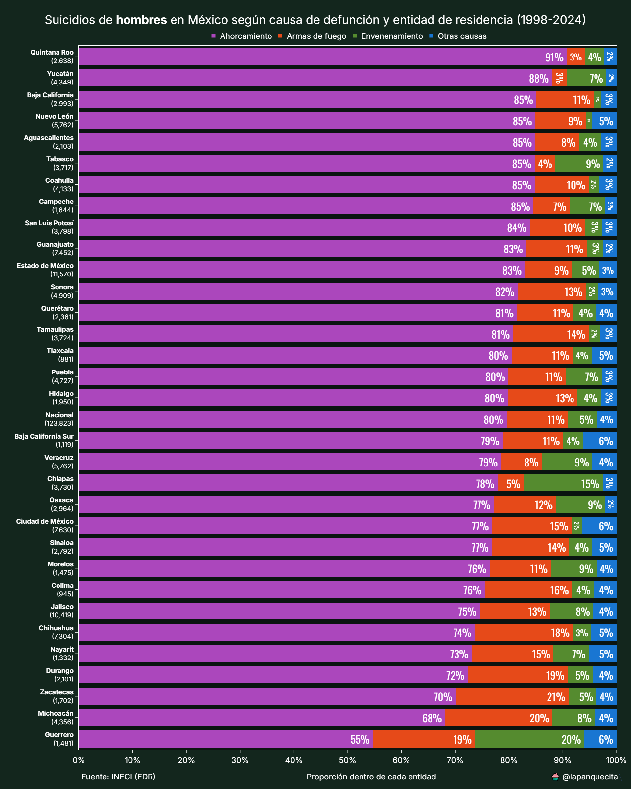
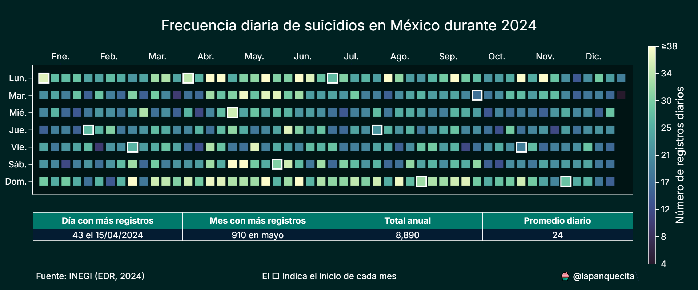
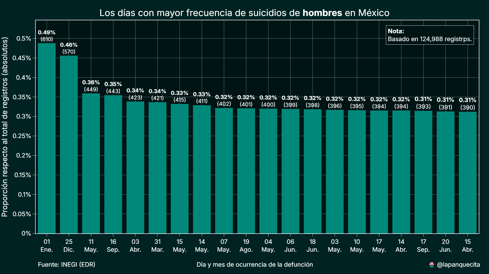

# Suicidios en México

Este proyecto reúne un conjunto de scripts que permiten estudiar, desde distintas perspectivas, la evolución y características de las defunciones por suicidio en México. Su propósito es ofrecer una base sólida para análisis exploratorios, visualizaciones comparativas y estudios más profundos sobre esta problemática social, todo utilizando información pública y reproducible.

Fuente de datos:
[https://www.inegi.org.mx/programas/edr/#microdatos](https://www.inegi.org.mx/programas/edr/#microdatos)

Además de permitir análisis puntuales, el proyecto busca facilitar un flujo de trabajo transparente: desde la obtención y depuración de los datos, hasta la generación de visualizaciones listas para presentaciones, artículos o investigaciones académicas.

## Requisitos

* Python 3.13 o superior.
  Usar una versión reciente permite aprovechar mejoras en el procesamiento de datos y ejecutar los scripts sin contratiempos.

* Librerías incluidas en `requirements.txt`.
  Este archivo concentra todas las dependencias necesarias para asegurar que los análisis sean reproducibles y consistentes.

## Recolección de datos

Todo el trabajo parte de los microdatos de defunción del INEGI, que ofrecen un nivel de detalle considerable y permiten realizar filtrados muy específicos. Para garantizar la coherencia histórica, se implementó un proceso de selección que respeta los distintos sistemas de clasificación utilizados a lo largo del tiempo.

* 1990–1997: se emplea el código 52 en el campo `LISTA_BAS`, correspondiente a lesiones autoinfligidas en la lista básica.
* 1998 en adelante: el INEGI adopta la CIE-10, por lo que se utiliza el código 101 en el campo `LISTA1`.

Este cambio de codificación representa un reto metodológico frecuente en estudios de largo plazo, por lo que se implementó una estrategia de equivalencias para mantener la comparabilidad.

Una vez descargados y filtrados todos los años disponibles, los datos se consolidan en un solo archivo (`data.csv`) ubicado en la raíz del repositorio. Durante este proceso se eliminan campos redundantes para agilizar los análisis posteriores.

## Consideraciones

Los microdatos del INEGI, como cualquier base administrativa, presentan ciertas limitaciones que es importante tener presentes al interpretar los resultados:

* Los registros abarcan únicamente defunciones clasificadas formalmente como suicidio, por lo que no se incluyen intentos de suicidio ni eventos no concluyentes.
* Algunos casos contienen datos faltantes de variables relevantes, como edad, sexo o entidad de residencia.
* Para garantizar consistencia con la metodología del INEGI, el análisis utiliza la entidad de residencia, no la de ocurrencia.
* La desagregación por sexo es fundamental, ya que los patrones entre hombres y mujeres suelen ser marcadamente distintos.
* Las causas de suicidio se agrupan en cuatro categorías principales: ahorcamiento, armas de fuego, envenenamiento y otras causas. Esta clasificación busca equilibrar detalle y claridad interpretativa, evitando una fragmentación excesiva que dificulte la comparación.

Estas consideraciones permiten comprender mejor qué representa (y qué no representa) la información analizada.

## Análisis

El repositorio incluye scripts que automatizan pasos comunes de análisis y visualización. La intención es que cualquier persona interesada pueda replicar los resultados, adaptarlos o utilizarlos como base para estudios más complejos.

A continuación se presenta un resumen de lo que genera cada script.

### tendencia.py

Genera gráficas de línea que muestran la evolución de las tasas de suicidio por sexo y causa de defunción a lo largo del tiempo. Estas visualizaciones ayudan a identificar tendencias sostenidas, rupturas de tendencia, posibles efectos estacionales y diferencias entre grupos poblacionales.

Las tasas se estiman utilizando las proyecciones de población del CONAPO, lo que permite estandarizar los valores y compararlos entre años.

### mapa_coropletico.py

Genera un mapa coroplético a nivel estatal que muestra cómo se distribuyen las tasas de suicidio entre las entidades federativas. Esta vista es útil para identificar regiones con mayor incidencia, contrastes geográficos y patrones territoriales persistentes.

En la parte inferior se presenta un desglose por entidad y sexo, ordenado de mayor a menor, que facilita la comparación entre estados.

### mapa_calor.py

Produce mapas de calor que reflejan la evolución temporal de las tasas según grupos quinquenales de edad y sexo. Este formato permite detectar cohortes con mayor riesgo y observar cambios generacionales a lo largo del tiempo.

Los colores representan intensidad relativa: tonalidades rojizas indican valores más altos y tonos azulados, valores más bajos.

### comparacion_causas.py

Se centra en comparar las distintas causas de defunción por suicidio mediante visualizaciones intuitivas y consistentes.

Comienza con comparaciones por sexo usando gráficas de dona para mostrar proporciones relativas. También incluye tendencias anuales, distribuciones por edad y análisis por entidad.

En las gráficas por edad y por entidad, el orden se define tomando como referencia la categoría de ahorcamiento, ya que históricamente es la más frecuente y ofrece un punto de comparación estable.

En la carpeta imgs se incluyen las gráficas correspondientes a ambos sexos. En este documento se presentan únicamente las visualizaciones para hombres con el fin de optimizar el espacio y agilizar la lectura.

### calendario.py

Explora la distribución del fenómeno a lo largo del calendario anual. Genera una visualización tipo calendario en la que cada día del año se colorea según la frecuencia registrada, lo que facilita la detección de patrones estacionales o fechas con recurrencia notable.

Como complemento se incluye una gráfica de barras con los días históricamente más frecuentes, proporcionando una lectura rápida de patrones temporales.

## Conclusión

El análisis sistemático de datos públicos permite identificar patrones significativos en un fenómeno complejo como el suicidio. La integración de enfoques temporales, geográficos, demográficos y por causa ofrece una visión amplia y matizada que puede apoyar investigaciones, reportes y políticas públicas.

El repositorio se actualizará conforme se incorporen nuevos métodos o se amplíe la cobertura de datos.